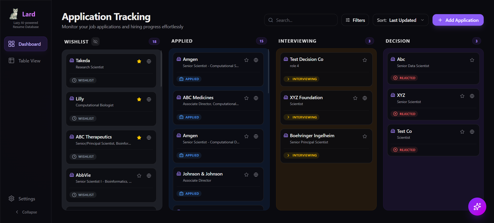
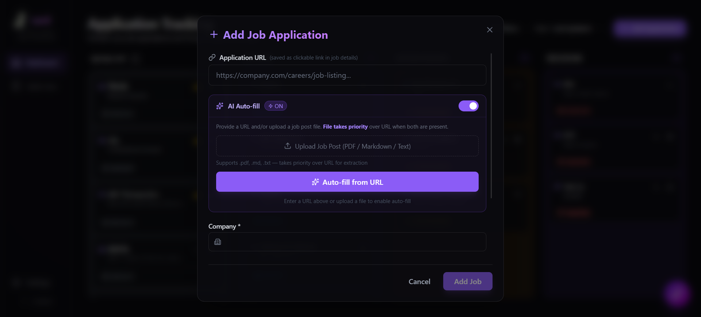
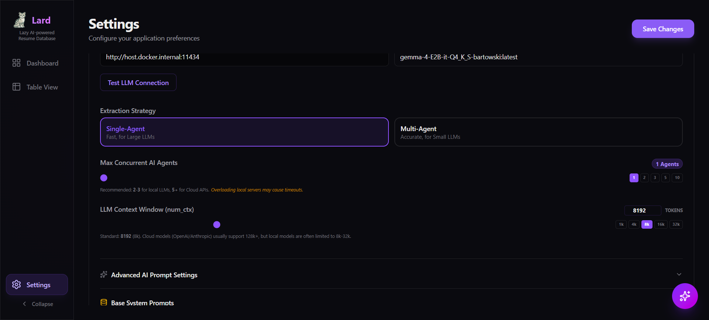

# 🐱 Lard - Lazy AI-powered Resume Database


### **Automated extraction • Interview tracking • RAG-powered Chat**

An AI-powered, high-performance job application tracking system with automated data extraction, document management, and interview pipeline visualization.

[Features](#🚀-key-features) • [Getting Started](#🛠️-getting-started) • [Docker](#🐳-docker-deployment-recommended) • [Docs](#📚-documentation)

---

## 📸 Application Showcase

### Dashboard & Kanban Pipeline


### Intelligent AI Extraction


### Advanced Configuration


---

## 🚀 Key Features

### 🤖 Intelligent AI Extraction
- **Multi-Strategy Parsing**: Automated extraction from URLs, PDFs, and raw text.
- **JSON-LD First**: Prioritizes structured Schema.org data for 100% extraction accuracy on modern job portals.
- **Agentic Pipeline**: Supports both high-speed Single-Agent mode and high-fidelity Multi-Agent mode (parallel field extraction).
- **Verbatim Descriptions**: Preserves original job description formatting and hierarchy in Markdown using specialized extraction agents and layout-aware parsing.
- **Centralized Truncation**: Intelligently manages context window limits based on user-configurable `num_ctx`, ensuring stable extraction on hardware-limited systems.
- **Robust Field Validation**: Specialized `json_validator_node` and `text_validator_node` perform targeted QA on the description field, with a **3-retry limit** that injects specific failure feedback into the next extraction attempt.

### 📊 Powerful Visualization
- **Dynamic Kanban**: Drag-and-drop job hunt pipeline with 4 standard stages and a specialized **Tabbed Mobile UI** for single-column focus on small screens.
- **Data Table**: High-fidelity list view with advanced sorting, filtering, and density-rich tooltips.
- **Interview Tracking**: Manage every step with full CRUD, inline editing, and lifecycle guards (Applied/Interviewing status synchronization).

### ⚡ Extreme Performance
- **Instant Backend Startup**: Cold start in **< 5 seconds** via background eager loading and synchronized initialization using the `app_factory` pattern.
- **Local Embedded Models**: Uses `all-MiniLM-L6-v2` for embeddings with a persistent local model cache.
- **Dynamic Settings**: Change LLM providers (Ollama, OpenAI, Anthropic), models, or themes in real-time without restarts.

---

## 📂 Project Structure

- **`/backend`**: FastAPI ecosystem. Handles data persistence (SQLAlchemy + SQLite), vector search (ChromaDB), and AI orchestration (LangGraph).
- **`/frontend`**: Next.js 16 + React 19 + Tailwind CSS 4. Acts as the secure gateway via **API Proxying** and **Server Actions**.
- **`/assets`**: Project icons, screenshots, and documentation media.

---

## 🛠️ Getting Started

### 1. Setup & Installation
```bash
# Backend
cd backend
uv sync

# Frontend
cd frontend
npm install
```

### 2. Running in Development
```bash
# Start Backend (Optimized Reload)
cd backend
./run.sh dev

# Start Frontend
cd frontend
npm run dev
```

### 3. Running in Production
```bash
# Start Backend (4 Workers, No Reload)
cd backend
./run.sh prod
```

```

---

## 🐳 Docker Deployment (Recommended)

Run the entire stack with a single command using Docker Compose.

### 1. Requirements
- Docker and Docker Compose installed.
- Ollama running on the host (if using local models).

### 2. Configuration
The application uses a unified configuration system. Copy the environment template to get started:
```bash
cp .env.example .env
```
### 3. Startup

#### Option A: Docker Compose (Recommended)
```bash
docker-compose up -d --build
```
Access the application at **[http://localhost:8081](http://localhost:8081)**.

#### Option B: Manual Docker Commands
If `docker-compose` is unavailable, use these commands to set up networking and start the containers:

```bash
# 1. Create Network & Volume
docker network create lard-net
docker volume create lard-data-vol

# 2. Build Images
docker build -t lard-backend ./backend
docker build -t lard-frontend ./frontend

# 3. Run Backend
docker run -d \
  --name lard-backend \
  --network lard-net \
  --add-host=host.docker.internal:host-gateway \
  -v lard-data-vol:/app/data \
  -e RUNNING_IN_DOCKER=true \
  -e LARD_DATA_DIR=/app/data \
  -e LARD_OLLAMA_BASE_URL=http://host.docker.internal:11434 \
  lard-backend

# 4. Run Frontend
docker run -d \
  --name lard-frontend \
  --network lard-net \
  -p 3030:3000 \
  -e INTERNAL_BACKEND_URL=http://lard-backend:8000 \
  lard-frontend
```
Access the application at **[http://localhost:3030](http://localhost:3030)**.

### 4. Persistence
All data is consolidated into a project-root **`/data`** directory, which is persisted across both local development and Docker.
- **SQLite**: `data/db/tracker.db`
- **Settings**: `data/app_settings.json`
- **Uploads**: `data/uploads/`
- **ChromaDB**: `data/chroma_db/`
- **AI Cache**: `data/huggingface/`
- **AI Logs**: `data/tmp/`

---

## 📚 Documentation
For detailed architecture, API endpoints, and optimization details, refer to:
- [Backend README](file:///home/Lard/backend/README.md)
- [Codebase Map](file:///home/Lard/codebase-map.md)

---
Built with ❤️ by Antigravity.
Current version: v0.67.5
