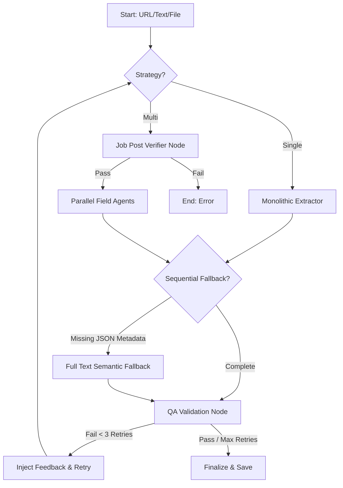
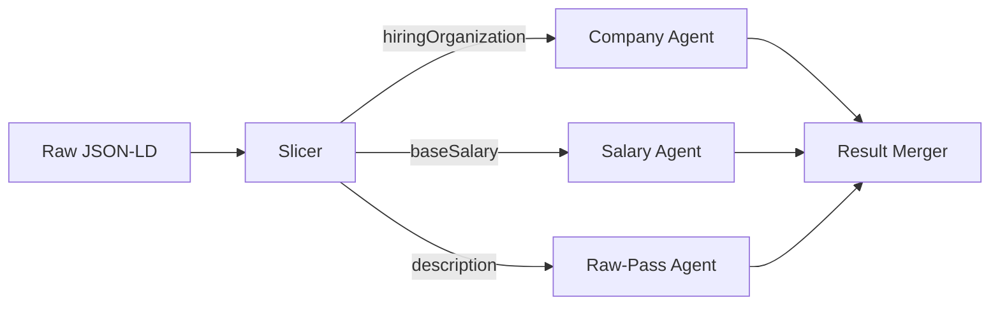

# 🐱 Lard - Backend

FastAPI-based backend for the **Lard** (Lazy AI-powered Resume Database) application.

## 🚀 Getting Started

### 1. Prerequisites
- [uv](https://github.com/astral-sh/uv) (Extremely fast Python package & environment manager)
- Python 3.14+

### 2. Setup
```bash
uv sync
```

### 3. Development Mode
Optimized for instant reloads by targeting only source code directories.
```bash
chmod +x run.sh
./run.sh dev
```

### 4. Production Mode
Optimized for performance and concurrency (4 workers).
```bash
chmod +x run.sh
./run.sh prod
```

## 🧪 Testing

The backend follows a script-based verification strategy. All test scripts are maintained in [backend/tests](file:///home/Lard/backend/tests).

### Running Tests
To verify API endpoints or AI logic, use the provided test suite:
```bash
cd backend
uv run python -m tests.test_ai_extraction  # Example
```

---

## 🧠 AI Extraction Engine (The Routing Matrix)

**Lard** features a sophisticated AI extraction pipeline that adapts to both the model's capability and the source material's structure.

### 📊 Strategy vs. Input
The system automatically routes tasks based on the **Extraction Strategy** (configured in Settings) and the **Input Type** detected by the parser.

| Strategy | Input: JSON-LD (URL) | Input: Text (URL, PDF, Markdown) |
| :--- | :--- | :--- |
| **Single-Agent** | Monolithic prompt mapping Schema.org data to JobDetails. | Monolithic prompt with embedded self-verification logic. |
| **Multi-Agent** | Parallelized fragment routing (bypasses LLM for missing fields). | 8+ parallel field-specific agents with raw-pass description extraction. |

---

### 🚀 Strategy 1: Single-Agent (High-Performance)
Ideal for frontier models (GPT-4o, Claude 3). 
- **Embedded Verification**: In Text mode, the prompt includes instructions to verify content and detect hallucinations in a single pass, reducing latency.
- **Strict Mapping**: Directly converts structured JSON-LD into the application's schema.

### 🎭 Strategy 2: Multi-Agent (Small-Model/Parallel)
Optimized for local models (Gemma, Llama) through task decomposition.
- **Verification Node**: A dedicated `check_job_post_node` halts execution immediately if the content is not a job posting.
- **Parallel Fields**: Extracts Company, Role, Salary, etc., concurrently using `asyncio.Semaphore` (configurable concurrency).
- **JSON Fragment Routing**: To save tokens, the system slices JSON-LD and only sends relevant snippets to specific agents (e.g., `baseSalary` goes only to the Salary agent).
- **Raw-Pass Description**: The description field is extracted without a strict JSON schema to prevent truncation and hangs common with small models.

---

## 🔄 Common AI Logic

Regardless of strategy, the following core features ensure 100% extraction fidelity:

### 1. Sequential Fallback Strategy
The engine prioritizes structured data but falls back to semantic reasoning if needed:
- **Priority A (JSON-LD)**: Attempts to extract 100% accurate data from `<script type="application/ld+json">`.
- **Heuristic Validation**: If critical fields (Company, Role) are "N/A", placeholders, or missing, a fallback is triggered.
- **Priority B (Full Text)**: Re-parses the raw page content to fill the gaps.
- **Result Merging**: Merges findings, treating JSON-LD as the primary source of truth.

### 2. QA Validation Loop (Circuit Breaker)
Each extraction is validated by a dedicated **QA Node** with a 3-retry limit:
- **Completeness Check**: Ensures the LAST items of lists (responsibilities, requirements) are present.
- **Feedback Injection**: If validation fails, the specific failure reason is injected into the next extraction attempt's prompt to "guide" the LLM toward a fix.
- **UI Flagging**: If the circuit breaker trips after 3 attempts, a `hallucination_detected` flag is set, triggering a warning in the UI.

---

## 📈 Visual Workflows

### AI Extraction Lifecycle


### Multi-Agent JSON Routing


---

## ⚡ Architecture & Optimization

### Lazy Loading & Startup
The backend reaches a "Ready" state in **< 5 seconds** through:
- **`app_factory` pattern**: Library imports are deferred until needed.
- **Targeted Reloader**: `uvicorn` watches only `/backend` source files, ignoring `.venv` and `uploads`.
- **Embedding Cache**: Local model cache for `sentence-transformers` to avoid cold-start downloads.

## 📁 Directory Structure
- `ai/`: LangGraph agents, LLM factory, and prompt definitions.
- `database/`: SQLAlchemy models and ChromaDB vector store.
- `routers/`: API endpoint definitions (REST & SSE).
- `tests/`: Verification scripts and backend test suite.
- `uploads/`: Repository for uploaded documents.
