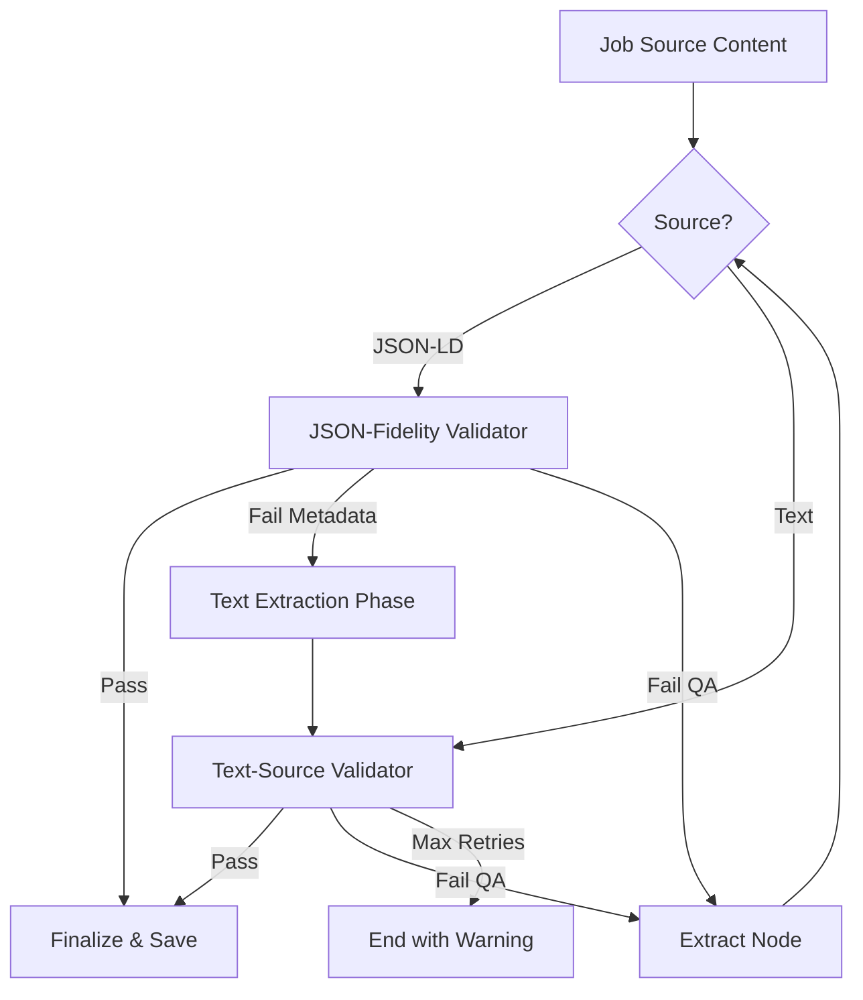
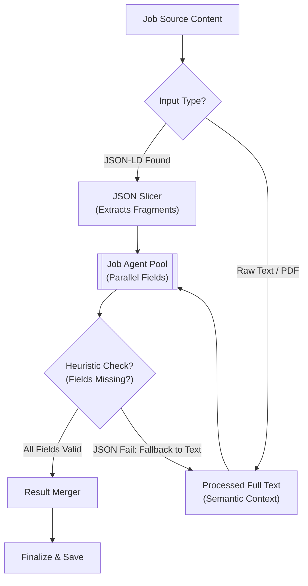

# 🐱 Lard - Backend (v0.84.3)

FastAPI-based backend for the **Lard** (Lazy AI-powered Resume Database) application.
Designed for **Infrastructure Isolation**; this backend is kept private and is only accessible via the Next.js API Proxy.

## 🚀 Getting Started

### 1. Prerequisites
- [uv](https://github.com/astral-sh/uv) (Extremely fast Python package & environment manager)
- Python 3.14+

### 2. Setup
```bash
uv sync
```

### 3. Development Mode
Optimized for instant reloads by targeting only source code directories.
```bash
chmod +x run.sh
./run.sh dev
```

### 4. Production Mode
Optimized for performance and concurrency (4 workers).
```bash
chmod +x run.sh
./run.sh prod
```

## ⚙️ Configuration & Environment Variables

The backend uses [pydantic-settings](https://docs.pydantic.dev/latest/concepts/pydantic_settings/) for robust configuration management.

### Priority Hierarchy
1. **User Overrides**: Values set in `data/app_settings.json` (via the Settings UI).
2. **System Environment**: Variables prefixed with `LARD_` (e.g., `LARD_OPENAI_API_KEY`).
3. **Environment File**: Values in the root `.env` file.
4. **Factory Defaults**: Hardcoded safe defaults.

### Key Environment Variables
| Variable | Description | Default |
| :--- | :--- | :--- |
| `LARD_DATA_DIR` | Base directory for all data. | `../data` (local) / `/app/data` (Docker) |
| `LARD_DB_DIR` | Directory for SQLite files. | `DATA_DIR/db` |
| `LARD_UPLOADS_DIR` | Directory for uploaded documents. | `DATA_DIR/uploads` |
| `LARD_CHROMA_DIR` | Directory for vector storage. | `DATA_DIR/chroma_db` |
| `LARD_HF_HOME` | Centralized AI model cache. | `DATA_DIR/huggingface` |
| `LARD_TMP_DIR` | Temporary diagnostic logs. Features microsecond-level isolation for concurrent agents. | `DATA_DIR/tmp` |
| `LARD_OLLAMA_BASE_URL` | Ollama API endpoint. | `http://host.docker.internal:11434` |

### AI Model Management
The backend explicitly manages model caching to prevent redundant downloads:
- **`HF_HOME`**: Primary cache for all HuggingFace-related models (Embeddings, NLP).
- **`DOCLING_ARTIFACTS_PATH`**: Specialized cache for Docling's layout and OCR models (subfolder of `HF_HOME`).

## 🧪 Testing

The backend follows a script-based verification strategy. All test scripts are maintained in [backend/test](file:///home/Lard/backend/test), with diagnostics and verification scripts organized in the `experiments/` subfolder.

### Running Tests
To verify API endpoints or AI logic, use the provided test suite:
```bash
cd backend
uv run python -m test.test_ai_extraction  # Example
```

---

## 🧠 AI Extraction Engine (The Routing Matrix)

**Lard** features a sophisticated AI extraction pipeline that adapts to both the model's capability and the source material's structure.

### 📊 Strategy vs. Input
The system automatically routes tasks based on the **Extraction Strategy** (configured in Settings) and the **Input Type** detected by the parser. 

#### 🧠 AI Logic & Fidelity
- **Prompt Infrastructure**: Centralized prompt management in `prompts.py` with structural instruction separators (`--- ADDITIONAL USER INSTRUCTIONS ---`, `--- SELF-CORRECTION / FEEDBACK ---`) and data isolation via triple-quote (`"""`) delimitation. This ensures consistent behavioral enforcement and prevents instruction bleeding.
- **UI-Controlled Prompts**: All fidelity logic is governed by system prompts editable in the UI, removing hidden Pydantic field constraints.

| Strategy | Input: JSON-LD (URL) | Input: Text (URL, PDF, Markdown) |
| :--- | :--- | :--- |
| **Single-Agent** | Monolithic prompt mapping Schema.org data to JobDetails. | Monolithic prompt with **Embedded Self-Verification** logic. |
| **Multi-Agent** | Parallelized fragment routing (Bypasses LLM for missing fields). | 8+ parallel field-specific agents with raw-pass description extraction. |

---

### 🚀 Strategy 1: Single-Agent (High-Performance)
Ideal for frontier models (GPT-4o, Claude 3). 
- **Monolithic Context**: A single sophisticated LLM call captures all metadata and the description.
- **Embedded Verification**: In Text mode, the prompt includes an internal verification block to confirm "is_job_post" and "detected_category" without a separate node call.
- **Strict Mapping**: Directly converts structured JSON-LD into the application's schema.

#### Single-Agent Pipeline (Flowchart)


### 🎭 Strategy 2: Multi-Agent (Small-Model/Parallel)
Optimized for local models (Gemma, Llama) through task decomposition.
- **Verification Node**: A dedicated `check_job_post_node` runs as the first step to halt execution immediately on non-job content.
- **Parallel Fields**: Extracts Company, Role, Location, Salary, ID, Posted, Deadline, and Description concurrently using `asyncio.Semaphore`.
- **JSON Fragment Routing**: To save tokens and stay within context limits, the system slices JSON-LD and only sends relevant snippets to specific agents (e.g., `baseSalary` goes only to the Salary agent).
- **Comprehensive Text Context**: In Full Text mode (or fallback), the system provides the **complete cleaned text** of the job post to each specialized agent. This ensures that even buried details (like a Salary range in a footer) are captured.
- **Raw-Pass Description**: The description field is extracted without a strict JSON schema to prevent truncation and hangs.



---

## 🔄 Core AI & Data Patterns

The **Lard** backend follows strict standards for data integrity and AI orchestration to ensure high fidelity across all providers.

### 1. Modern Pydantic Integration (v2.x)
Fully migrated to Pydantic v2 standards for high-performance validation and serialization:
- **Type Safety**: Uses `AwareDatetime` (UTC-enforced), `HttpUrl` (HTTPS-normalized), and `NameEmail` (RFC-compliant) for all incoming metadata.
- **Security**: Sensitive credentials (API keys) are managed using `SecretStr` in `config.py` to prevent leakage in logs or debug output.
- **Automated Normalization**:
    - `model_validator`: Automatically populates dedicated name fields (e.g., `hiring_manager_name`) from the display name part of a `NameEmail` string if the field is empty.
    - `to_db_dict`: Centralized helper that serializes complex Pydantic types (Enums, URLs, Emails) into plain strings compatible with SQLite.
- **Config Management**: Uses `SettingsConfigDict` with `extra='ignore'` and a custom `_deep_merge` utility to synchronize factory default prompts with user overrides in `app_settings.json`.

### 2. Global Error Handling
The backend implements a custom `RequestValidationError` handler in `main.py` that translates complex Pydantic errors into human-readable, field-specific feedback (e.g., `[hr_email]: invalid email format`) for immediate consumption by the frontend.

### 3. Persistent AI Assistant (LangGraph v1.0)
The **Chat Assistant** is a stateful LangGraph agent utilizing `AsyncSqliteSaver`:
- **Persistence**: Conversation state is saved to `data/db/ai_history.db`.
- **Thread Isolation**: Multiple concurrent conversations are supported via `session_id` isolation.
- **Sanitized Output**: Chat session titles are generated as plain text, explicitly forbidding Markdown in the prompt and applying a backend `strip()` safety net.

### 4. Extraction Engine & QA Loop
The system uses a multi-stage pipeline (Single vs. Multi-Agent) with a **QA Circuit Breaker**:
- **Verification Nodes**: Confirms "is_job_post" before proceeding.
- **Guided Retries**: If validation (JSON/Text) fails, specific feedback is injected into the prompt for up to 3 guided extraction attempts.
- **Prompt Sync**: All system prompts are isolated in `backend/ai/prompts.py` and served via `/api/settings/defaults` to ensure the frontend reset UI remains synchronized with the backend logic. Employs structural headers and triple-quote delimiters for robust data isolation.

---

## ⚡ Architecture & Optimization
### Lazy Loading & Startup
The backend reaches a "Ready" state in **< 5 seconds** through:
- **`app_factory` pattern**: Library imports are deferred until needed.
- **Background Preloading**: Heavy AI components (LangGraph, Docling converter) are warmed up in a background thread during `lifespan` to eliminate first-use latency.
- **Targeted Reloader**: `uvicorn` watches only `/backend` source files, ignoring `.venv` and `uploads`.
- **Embedding Cache**: Local model cache for `sentence-transformers` to avoid cold-start downloads.

## 📁 Directory Structure
- `ai/`: LangGraph agents, LLM factory, and prompt definitions.
- `database/`: SQLAlchemy models and ChromaDB vector store.
- `routers/`: API endpoint definitions (REST & SSE).
- `test/`: Verification scripts and backend test suite.
- `data/` (Root): Consolidated persistence for DB, Uploads, Chroma, Settings, and Tmp.

---

## 📜 License
This project is licensed under the **MIT License**. See the [LICENSE](../LICENSE) file for more details.
