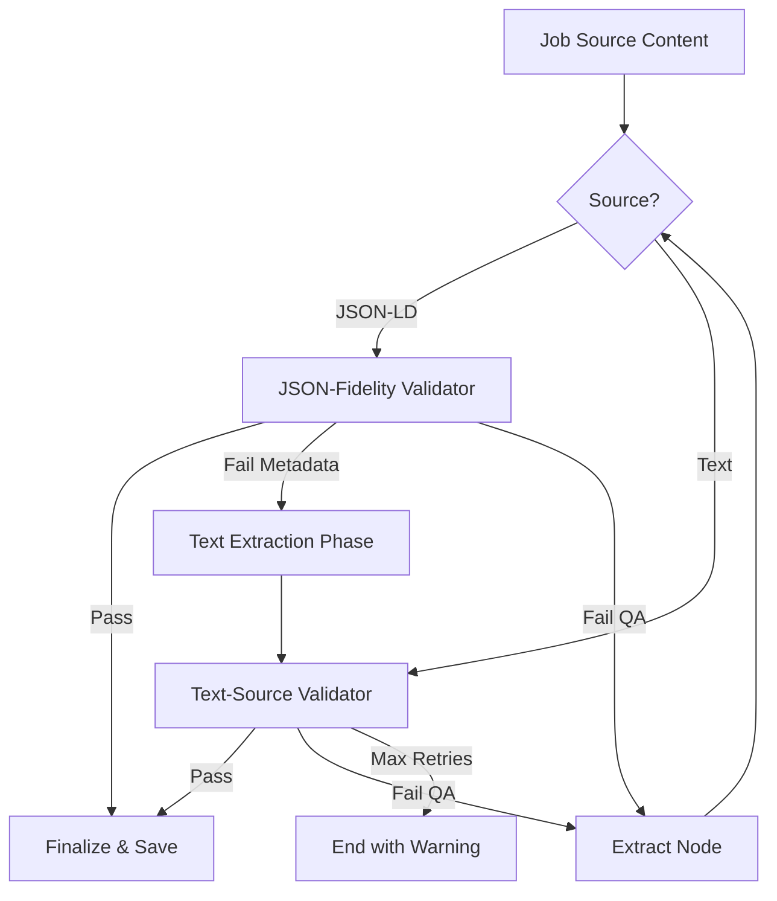
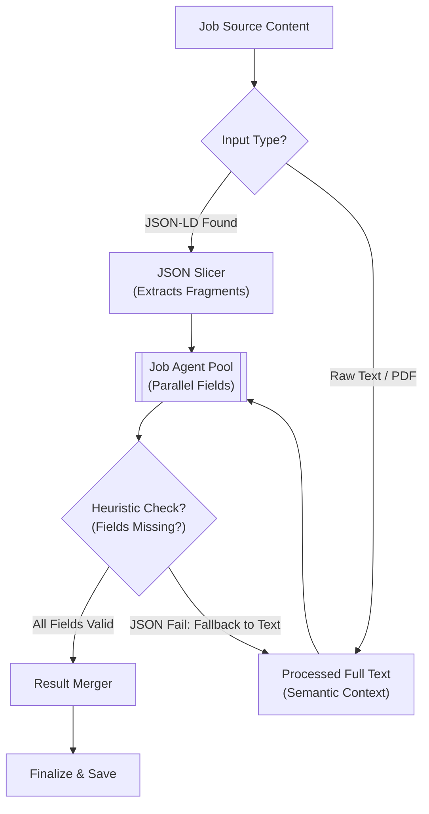

# 🐱 Lard - Backend

FastAPI-based backend for the **Lard** (Lazy AI-powered Resume Database) application.
Designed for **Infrastructure Isolation**; this backend is kept private and is only accessible via the Next.js API Proxy.

## 🚀 Getting Started

### 1. Prerequisites
- [uv](https://github.com/astral-sh/uv) (Extremely fast Python package & environment manager)
- Python 3.14+

### 2. Setup
```bash
uv sync
```

### 3. Development Mode
Optimized for instant reloads by targeting only source code directories.
```bash
chmod +x run.sh
./run.sh dev
```

### 4. Production Mode
Optimized for performance and concurrency (4 workers).
```bash
chmod +x run.sh
./run.sh prod
```

## ⚙️ Configuration & Environment Variables

The backend uses [pydantic-settings](https://docs.pydantic.dev/latest/concepts/pydantic_settings/) for robust configuration management.

### Priority Hierarchy
1. **User Overrides**: Values set in `data/app_settings.json` (via the Settings UI).
2. **System Environment**: Variables prefixed with `LARD_` (e.g., `LARD_OPENAI_API_KEY`).
3. **Environment File**: Values in the root `.env` file.
4. **Factory Defaults**: Hardcoded safe defaults.

### Key Environment Variables
| Variable | Description | Default |
| :--- | :--- | :--- |
| `LARD_DATA_DIR` | Base directory for all data. | `../data` (local) / `/app/data` (Docker) |
| `LARD_DB_DIR` | Directory for SQLite files. | `DATA_DIR/db` |
| `LARD_UPLOADS_DIR` | Directory for uploaded documents. | `DATA_DIR/uploads` |
| `LARD_CHROMA_DIR` | Directory for vector storage. | `DATA_DIR/chroma_db` |
| `LARD_HF_HOME` | Centralized AI model cache. | `DATA_DIR/huggingface` |
| `LARD_TMP_DIR` | Temporary diagnostic logs. | `DATA_DIR/tmp` |
| `LARD_OLLAMA_BASE_URL` | Ollama API endpoint. | `http://host.docker.internal:11434` |

### AI Model Management
The backend explicitly manages model caching to prevent redundant downloads:
- **`HF_HOME`**: Primary cache for all HuggingFace-related models (Embeddings, NLP).
- **`DOCLING_ARTIFACTS_PATH`**: Specialized cache for Docling's layout and OCR models (subfolder of `HF_HOME`).

## 🧪 Testing

The backend follows a script-based verification strategy. All test scripts are maintained in [backend/test](file:///home/Lard/backend/test).

### Running Tests
To verify API endpoints or AI logic, use the provided test suite:
```bash
cd backend
uv run python -m test.test_ai_extraction  # Example
```

---

## 🧠 AI Extraction Engine (The Routing Matrix)

**Lard** features a sophisticated AI extraction pipeline that adapts to both the model's capability and the source material's structure.

### 📊 Strategy vs. Input
The system automatically routes tasks based on the **Extraction Strategy** (configured in Settings) and the **Input Type** detected by the parser.

| Strategy | Input: JSON-LD (URL) | Input: Text (URL, PDF, Markdown) |
| :--- | :--- | :--- |
| **Single-Agent** | Monolithic prompt mapping Schema.org data to JobDetails. | Monolithic prompt with **Embedded Self-Verification** logic. |
| **Multi-Agent** | Parallelized fragment routing (Bypasses LLM for missing fields). | 8+ parallel field-specific agents with raw-pass description extraction. |

---

### 🚀 Strategy 1: Single-Agent (High-Performance)
Ideal for frontier models (GPT-4o, Claude 3). 
- **Monolithic Context**: A single sophisticated LLM call captures all metadata and the description.
- **Embedded Verification**: In Text mode, the prompt includes an internal verification block to confirm "is_job_post" and "detected_category" without a separate node call.
- **Strict Mapping**: Directly converts structured JSON-LD into the application's schema.

#### Single-Agent Pipeline (Flowchart)


### 🎭 Strategy 2: Multi-Agent (Small-Model/Parallel)
Optimized for local models (Gemma, Llama) through task decomposition.
- **Verification Node**: A dedicated `check_job_post_node` runs as the first step to halt execution immediately on non-job content.
- **Parallel Fields**: Extracts Company, Role, Location, Salary, ID, Posted, Deadline, and Description concurrently using `asyncio.Semaphore`.
- **JSON Fragment Routing**: To save tokens and stay within context limits, the system slices JSON-LD and only sends relevant snippets to specific agents (e.g., `baseSalary` goes only to the Salary agent).
- **Comprehensive Text Context**: In Full Text mode (or fallback), the system provides the **complete cleaned text** of the job post to each specialized agent. This ensures that even buried details (like a Salary range in a footer) are captured.
- **Raw-Pass Description**: The description field is extracted without a strict JSON schema to prevent truncation and hangs.



---

## 🔄 Common AI Logic

Regardless of strategy, the following core features ensure 100% extraction fidelity:

### 3. Contact Metadata Parsing
The system supports flexible contact formats for Hiring Managers, Recruiters, and Headhunters.
- **RFC 5322 Support**: Uses `email.utils.parseaddr` to support `Name <email@address.com>` formats.
- **Validation**: Pydantic `@field_validator` ensures that even with a display name, a valid email address is extracted and stored.
- **Normalization**: Automatically handles quoted names and special characters.

### 4. QA Validation Loop (Circuit Breaker)
Each extraction is validated by a specialized **Extraction Validation Node** with a 3-retry limit:
- **json_validator_node**: Specialized validator for JSON-LD sources. Focuses on HTML fidelity and heuristic metadata completeness. Triggers a fallback to Text mode if key metadata (Company, Role, etc.) is missing or low-quality.
- **text_validator_node**: Specialized validator for Raw Text sources. Focuses on boundary detection and semantic completeness.
- **Fast Pass Logic**: If a description has already been verified by the JSON-LD fidelity pass, the system automatically bypasses the text-mode QA validation to preserve resources and prevent false-positive rejections.
- **Feedback Injection**: If validation fails, the failure reason is injected into the prompt of the extraction node for the guided retry.
- **UI Flagging**: If the circuit breaker trips after 3 attempts, the final output is preserved but flagged with an amber "Hallucination Detected" warning in the frontend.


---

## ⚡ Architecture & Optimization

### Lazy Loading & Startup
The backend reaches a "Ready" state in **< 5 seconds** through:
- **`app_factory` pattern**: Library imports are deferred until needed.
- **Targeted Reloader**: `uvicorn` watches only `/backend` source files, ignoring `.venv` and `uploads`.
- **Embedding Cache**: Local model cache for `sentence-transformers` to avoid cold-start downloads.

## 📁 Directory Structure
- `ai/`: LangGraph agents, LLM factory, and prompt definitions.
- `database/`: SQLAlchemy models and ChromaDB vector store.
- `routers/`: API endpoint definitions (REST & SSE).
- `test/`: Verification scripts and backend test suite.
- `data/` (Root): Consolidated persistence for DB, Uploads, Chroma, Settings, and Tmp.

---

## 📜 License
This project is licensed under the **MIT License**. See the [LICENSE](../LICENSE) file for more details.
